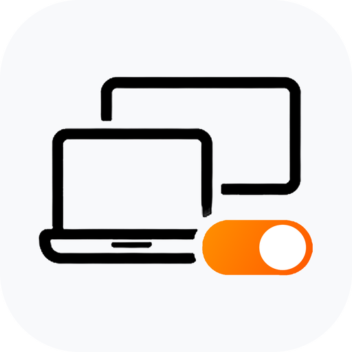

  
  <h1>Evan</h1>
  
<strong>Independent developer behind OriVibes.</strong>

  
I build focused macOS utilities and practical products for modern, AI-assisted work.

  

    <a href="https://orivibes.com/">OriVibes</a>
    &nbsp;&middot;&nbsp;
    <a href="https://openmonitor.orivibes.com/">OpenMonitor</a>
  

## Building now

<table>
  <tr>
    <td width="112" align="center">
      
    </td>
    <td>
      <h3>OpenMonitor</h3>
      
A macOS menu-bar utility that keeps remote multi-display work simple: switch off displays you cannot see, keep one screen reachable, and restore the desk layout when you return.

      

        <a href="https://github.com/orivibes-com/openmonitor"><strong>Product overview</strong></a>
        &nbsp;&middot;&nbsp;
        <a href="https://openmonitor.orivibes.com/"><strong>Website &amp; download</strong></a>
      

    </td>
  </tr>
</table>

## What I care about

- Small products with a clear job
- Native, focused macOS experiences
- Practical AI workflows that save real time
- Thoughtful product design, documentation, and support

## OriVibes

OriVibes is my independent product studio. OpenMonitor is the first public product, with more utilities and experiments to follow.

---

Products may be closed source even when their public showcase repositories are available on GitHub.
